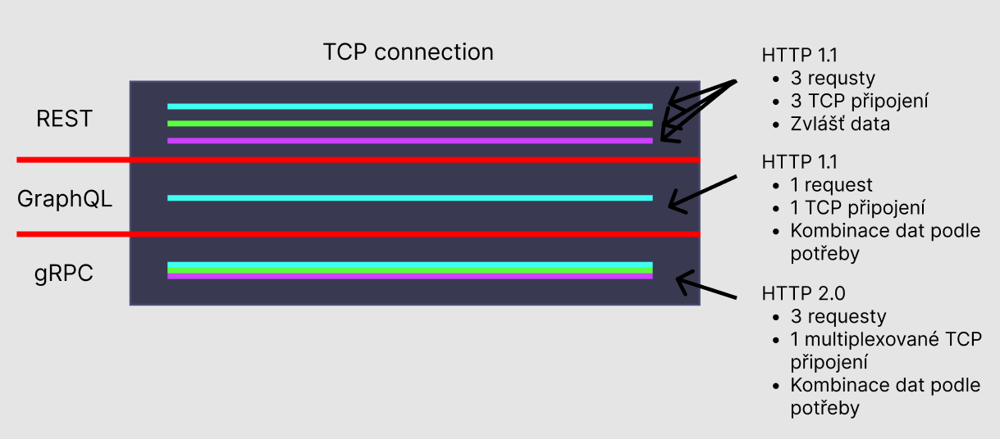

# grpc-rest-graphql-comparison

- Example gallery app

## FE

- React
  - Apollo
  - Axios

## BE

- Go (`:5000`)
  - GraphQL
  - REST
  - gRPC
- Node (`:5001`)
- Python (`:5002`)

## DB

- Redis

### Dev

- follow setup `/database/dev/redis-setup.md`
- 3 separate docker containers for redis master and replicas and 3 containers for sentinels

### Prod

- follow setup `/database/prod/redis-setup.md`
- kind-k8s cluster
  - 3 pods => master and two replicas
  - 3 sentinels => if master dies sentinel will promote one of the replicas to master

## Presentation

1. History => First there was REST...
2. Basics & Comparison of REST and GraphQL
3. gRPC how it works
4. Use cases
5. Pros & Cons
6. Comparison with other API paradigms (Webhook, Websocket, HTTP streaming, SOAP)

## API (Application Programming Interface)

- API is an interface trough which information and functionality can be shared between two services, where one service makes request and the other one provides response.

## REST (Representational State Transfer)

- returns JSON / XML
- basic CRUD operations on endpoints
- nonCRUD operations
  - Add flag in response
    - `PATCH /users/user-1`
    - `Body: {"archived": true}`
  - Add subresource as action's name
    - `PUT /users/user-1/archive`
  - Add query parameter for search
    - `PUT /users/user?id=1`

### Pros

- Standard method and arguments names
- Utilizes HTTP features
- Easy to maintain

### Cons

- Big payloads
- Multiple HTTP calls for resource and subresource

## GraphQL (Graph Query Language)

- returns JSON
- expose single endpoint
  - `app.com/graphql`
- developed in Facebook
- Only uses GET and POST requests
- Example apps => github, pinterest, airbnb

### Pros

- Define the exact data that is required
- Multiple nested data in single call, which results in quicker response time and smaller payload size
- Avoids versioning => has only one endpoint, in comparison with REST, where changing one endpoint can break whole app

### Cons

- Added complexity of handling the type of query that client constructs
- Optimizing performance => when working with multiple external clients their use cases may vary, so you have to find middleground for all of them
  - First client needs query for name and surname, while second client needs query for name, surname and age

## gRPC (grpc Remote Procedure Call)

- returns binary
- uses HTTP/2
- action functions on endpoints
- Originated in google
- Only uses GET and POST requests
- Example apps => slack

### Pros

- Easy to understand
- Lightweight payloads
- High performance

### Cons

- Not standardized so it can be difficult discover them
  - `app.com/api/user.getUsername`
- Limited standardization
- Can lead to function explosion as over time there will be more and more functions so it is important to keep track of all of them

## Conclusion

### REST

- Data driven
- Best for APIs that expose CRUD operations

### GraphQL

- Best for APIs that need querying flexibility

### gRPC

- Best for APIs exposing several actions instead of CRUD operations

### SOAP (Simple object access protocol)

- Function driven
- Before REST
- Messaging protocol specification for exchanging structured data
- main focus on easy communication between different platforms and languages

### Websocket

### Webhook

- Webhook is an event driven API.
- It is a service that allows one program to send data to another one as soon as a particular webhook event happens
- Client > Server communication with no response
- When user clicks on button event happens and data gets send to server instead of server continuously asking if button is clicked

### HTTP 1.1

- Using TCP connection
- With each new request comes new TCP connection

### HTTP 2.0

- Utilizes multiplexing to combine and compress requests into single TCP connection and giving them stream ID so after response is returned client can tell which request is which
- It pushes new responses into one TCP connetion if request requires more responses

GQL => jeden request který vrátí více dat
gRPC with HTTP 2.0 => více requestů kombinovaných v multiplexovaném TCP spojení

### Slide Intro

Kdo z vás už slyšel o gRPC (grpc remote procedure call) protokolu?
Já jsem se o této technologii dozvěděl když jsem se více začal zajímat o jazyk Go a svět krypta, mimochodem vřele doporučuju Go všem backenďákům, když už ne pro long-time use tak aspoň na vyzkoušení a pochopení možnosti paralelního programování, jazyk se používá především pro cloud engeneering a pro projekty které si chtějí zachovat jednoduchý memory management, rychlost a některé vlastnosti low level jazyků. Zrovna když jsem pracoval na jednom zkušebním projektu, který využíval právě Go na Backendu a React na Frontendu tak mě začalo zajímat jaké jsou nejlepší způsoby komunikace mezi různými jazyky a platformami tak aby se dala jedna paradigma API reusnout na co nejvíce servisů.

### Slide REST

Při hledání odpovědi jsem došel k názoru že opravdu záleží na daném use casu, pokud nám jde o jednoduchý projekt se základními CRUD operacemi je tady REST. Jistě všichni víte jak funguje ale jen pro zopakování:

- Definujeme v něm samostatné endpointy pro každý resource
- Využívá standardů HTTP metod (GET, POST, PUT, PATCH, ...)
- Nejčastěji používá JSON v některých případech XML serializaci dat
- Často se dostaneme do situace kdy pracujeme s hromadou nepotřebných dat
- Při async requestech a eventech nevyužívá plnou funkcionalitu HTTP2 k čemuž se dostanu později

### Slide GraphQL

- Stačí nám jeden endpoint pro všechny resources
- Využívá pouze http metod GET a POST
- Používá JSON serializaci dat
- Definujeme v něm přesnou strukturu dat kterou potřebujeme, což nám dovoluje mnohonásobné vnoření dat v jednom requestu narozdíl od RESTu kde pro každý resource děláme zvlášť request
- Nejlépe se používá na API, které potřebují flexibilní query. Například pokud bychom používali nějakou 3rd party API, která používá GraphQL mohla by nastat situace kdy jeden klient potřebuje specifickou část dat a budeme muset pro každého klienta vytvářet novou query

- Jsou tady ještě další možnosti jako třeba SOAP, Thrift, nebo JSON RPC, ale na ty se dnes nebudu zaměřovat

### Slide Evoluce HTTP

#### HTTP 0.9

- První verze HTTP
- Podpora jediné metody GET
- Nepoužívala se plná funkcionalita URL
- Přes jedno TCP připojení se mohl posílat pouze jeden soubour ve formátu html `GET /index.html` vrátilo `index.html`

#### HTTP 1.0

- První stabilní verze
- Přibyly funkce jako
  - status code
  - http headery
  - content type díky kterému se kromě html dokumentů daly přenášet i dokumenty jiného typu

#### HTTP 1.1

- Standardizovaná verze
- Možnost transféru více souborů v jednom TCP připojení
- encoding jazyků

- mezitím přišly další verze a funkcionality jako například autentikační header nebo caching

#### HTTP 2.0

- Zásadní změna pro TCP komunikaci kdy je díky multiplexingu možné v jednom TCP připojení udělat více requestů, kompresnout je a přidat jim stream ID pro pozdější identifikací v response
- Funkcionalita server push, například když uděláme request na `index.html` a server si všimne že na něm závisí `index.css` a `main.js` připojí je do response, při špatné konfiguraci nebo špatně nastaveném cachování však může způsobit nadbytečné data
- Binary serializace
- HTTPS by default
- Je pomalejší pokud vytváříme komunikaci se servisem který používá HTTP 1.1

#### HTTP 3.0

- Změna na multiplexovaný transfer dat pomocí QUIC přes protokol UDP

### Slide gRPC

- Každý komunikační protokol potřebuje client library, což je problém pro aplikace mimo prohlížeč kde při každé nové verzi nebo featuře musíme manuálně přidávat nové verze

  

Ukázat comparison HTTP 1.1 a HTTP 2.0 v developer tools network tabu
